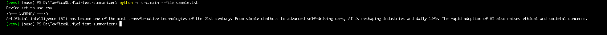
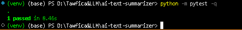

<div align="center">
# 🧠 AI Text Summarizer 📝  
### Efficient • Offline • LLM-Powered • Open Source  
[](https://www.python.org/) 
[](https://python.langchain.com/) 
[](https://huggingface.co/) 
[](LICENSE) 
[](https://github.com/TawficaBhuiyan/ai-text-summarizer/actions)
</div>

> ✨ Python-based AI summarizer powered by LangChain & LLMs — Summarizes long or short text into concise bullet points. Works offline or via Hugging Face cloud API.

## 🌟 Features
- ✨ Bullet-style text summarization  
- 🧩 Handles short & long documents via smart chunking  
- ⚙️ Fully offline (`facebook/bart-large-cnn`)  
- ☁️ Optional Hugging Face API integration  
- 💻 CLI-friendly (raw text or files)  
- ✅ Unit-tested

## 🧠 LLMs & LangChain
**LLMs** — AI models like *GPT-4*, *BART*, *T5*, trained to understand and generate human-like text.  
**LangChain** — Python framework for chaining LLM workflows with prompts, memory, and efficient text processing.

## 🗂️ Project Structure
```text
📦 ai-text-summarizer/
├── 📂 src/
│   ├── 🧠 main.py       → CLI entrypoint
│   ├── ✂️ summarizer.py → Summarization logic
│   └── 🧩 utils.py      → Text chunking utilities
├── 🧪 tests/
│   └── test_summarizer.py → Unit tests
├── 📸 docs/
│   └── screenshots/    → README images
├── ⚙️ .env.example      → Environment template
├── 📜 requirements.txt  → Dependencies
├── 🙈 .gitignore
└── 📘 README.md
⚙️ Installation
1️⃣ Clone the Repository
bash
Copy code
git clone https://github.com/TawficaBhuiyan/ai-text-summarizer.git
cd ai-text-summarizer
2️⃣ Create & Activate a Virtual Environment
PowerShell

powershell
Copy code
python -m venv .venv
.venv\Scripts\Activate.ps1
CMD

cmd
Copy code
python -m venv .venv
.venv\Scripts\activate
3️⃣ Install Dependencies
bash
Copy code
pip install -r requirements.txt
🔐 Environment Variables
bash
Copy code
USE_LOCAL_MODEL=true
# Optional Hugging Face API:
HUGGINGFACEHUB_API_TOKEN=hf_your_token_here
🚀 Usage
bash
Copy code
# Summarize raw text
python -m src.main --text "Python is versatile for AI & web development."

# Summarize a text file
python -m src.main --file sample.txt
⚙️ CLI Options
Option	Description
--text or -t	Raw text input
--file or -f	Summarize text file

🧪 Testing
bash
Copy code
python -m pytest -q
📸 Screenshots
<p align="center">  <br><i>Summarized output in terminal</i> </p> <p align="center">  <br><i>All unit tests completed successfully</i> </p>
🤝 Contributing
bash
Copy code
# Fork the repo & create branch
git checkout -b feature/your-feature
# Commit changes
git commit -m "Add feature"
# Push & open PR
git push origin feature/your-feature
Guidelines: Follow PEP 8, add tests, update docs if needed.

📌 Notes
⚙️ First run downloads model (~1.6 GB)

💻 Works on CPU; GPU optional

🔒 Offline = zero API cost

📚 References
LangChain Documentation

Hugging Face Transformers

LLMs Explained

⚡ License
MIT License © 2025 Tawfica Bhuiyan
